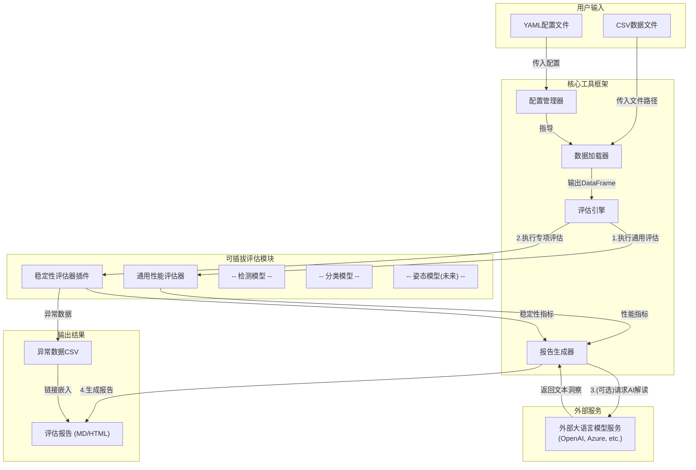
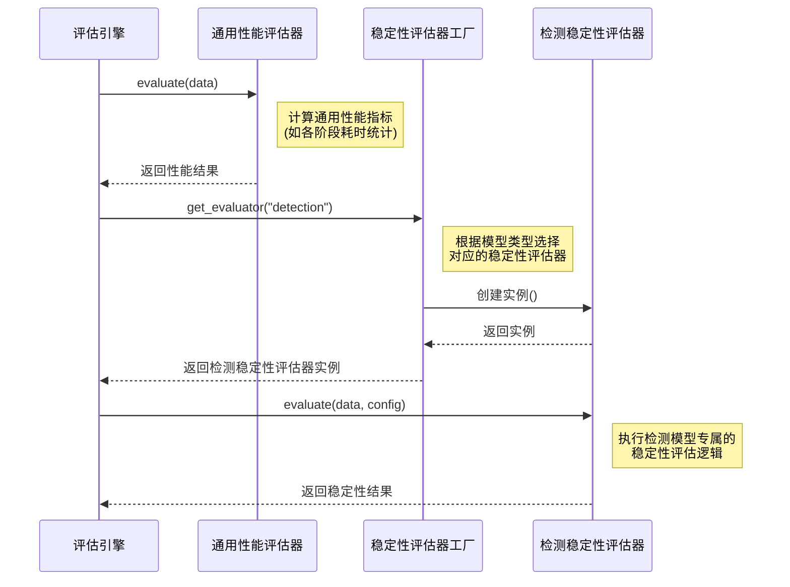
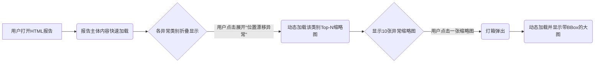
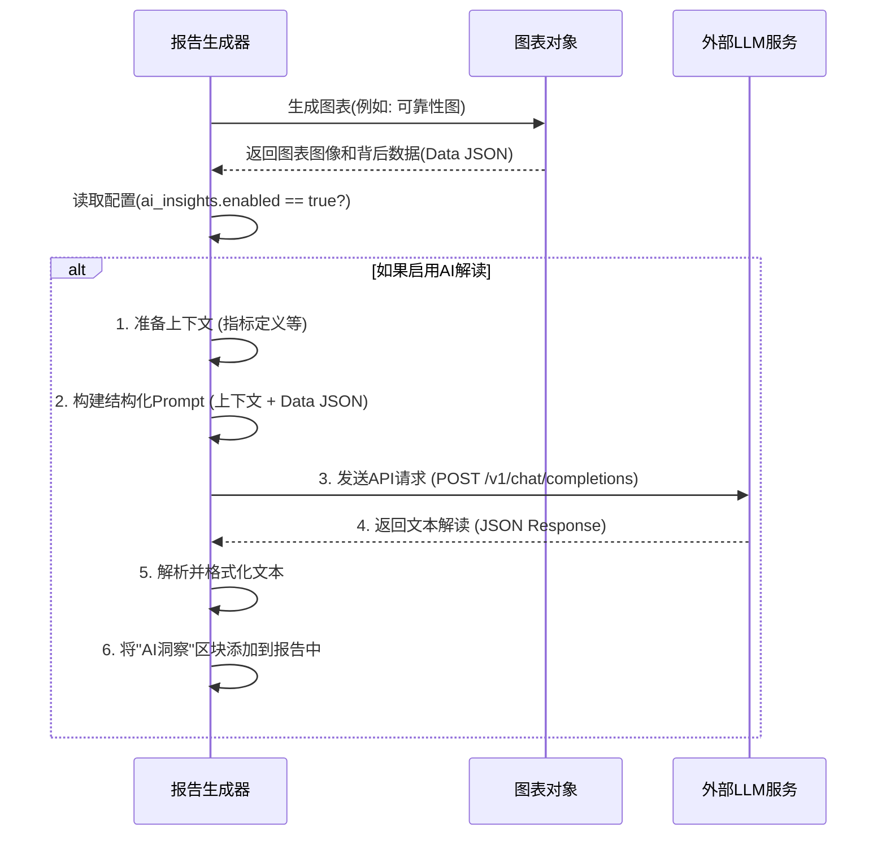
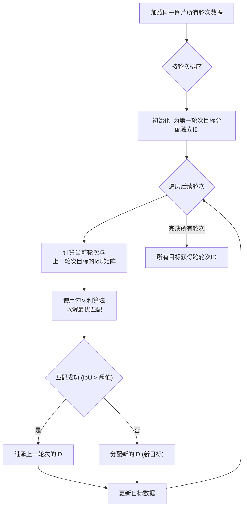
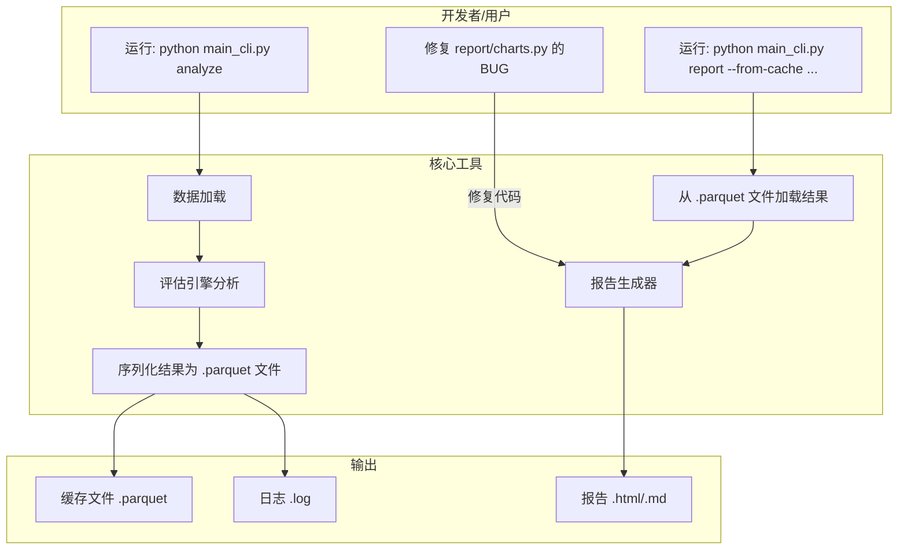

# 通用AI模型评估工具方案 V1.1

## 第1部分：通用AI模型评估工具框架方案

这部分定义了系统的通用骨架，它与具体模型无关，为所有模型评估提供统一的、可扩展的基础能力。

### 1.1 整体架构

工具的核心思想是“配置驱动、插件扩展、自动报告”。通过灵活的配置接入不同来源和格式的数据，利用插件化的评估器处理不同模型的评估逻辑，最终自动化生成富文本报告。



**流程说明:**

1. 用户提供数据CSV文件和YAML配置文件。
2. **配置管理器** 读取YAML，获取所有评估参数。
3. **数据加载器** 根据配置加载CSV数据，支持`Polars`引擎，并统一列名。
4. **评估引擎** 作为总控制器，将加载好的数据分发给评估模块。
5. 引擎**首先调用**唯一的、所有模型共用的`通用性能评估器`，计算耗时、FPS等通用性能指标。
6. 引擎**接着调用**`稳定性评估器工厂`，根据模型类型获取**专属的`稳定性评估器`**（如`检测模型稳定性评估器`），计算模型特定的稳定性指标。
7. 引擎将两部分评估结果聚合后，连同异常数据一起发送至**报告生成器**。
8. **报告生成器** 生成图文并茂的MD/HTML报告。MD报告使用`Seaborn`静态图，HTML报告使用`Plotly`交互图。
9. (实验性) 生成AI洞察: 如果用户在配置中启用了AI解读功能，报告生成器会将关键图表的背后数据序列化，并连同上下文一起发送给一个外部的大语言模型（LLM）服务，获取对图表的文字解读，并将其整合到最终报告中。

### 1.2 配置系统设计 (YAML)

- 采用YAML格式进行配置，实现评估流程的灵活控制，无需修改代码。
- 为了增强分类模型评估的灵活性，我们采用基于模式匹配（Pattern Matching）的方式来配置`Top-K`字段的映射，使其能够适应不同的评估需求（如Top-3, Top-5, Top-10）而无需改动配置结构。

**示例 `config.yaml`:**

```yaml
# 1. 基本信息
project_info:
  project_name: "XX业务线人脸识别模型稳定性测试"
  run_id: "20250702-1530-commit-a4e9c1f" # 建议使用 时间戳+Git哈希 的格式，""不填则默认用时间戳代替
  model_version: "v3.1.2-beta"
  model_type: "detection"  # 指定模型类型: detection, classification

# 2. 数据加载配置
data_loader:
  image_base_dir: "/path/to/user/image_dataset/" # 指定图库的根目录，用于解析相对路径
  field_mapping:
    detection:
      loop: "轮次ID"
      image_id: "图片名"
      image_path: "图片路径"      # 用于在报告中展示图片
      pre_time_ms: "前处理时间"
      inference_time_ms: "推理时间"
      post_time_ms: "后处理时间"
      total_time_ms: "前+推理+后处理时间"
      category_id: "种类（标签）"
      score: "置信度"
      # 边界框字段，根据 bbox_format 定义
      bbox: ["bbox_x", "bbox_y", "bbox_width", "bbox_height"]
    classification:
      loop: "轮次ID"
      image_id: "图片名"
      image_path: "图片路径"
      pre_time_ms: "前处理时间"
      inference_time_ms: "推理时间"
      post_time_ms: "后处理时间"
      total_time_ms: "前+推理+后处理时间"
      # 使用模式(pattern)来定义Top-K字段
      top_k_id_pattern: "top{k}标签id"
      top_k_score_pattern: "top{k}置信度"

# 3. 评估参数 (模型特定)
evaluation_params:
  detection:  # 检测模型的参数
    iou_threshold: 0.7
    z_score_threshold: 3.0
    bbox_format: "xywh"          # [新增] bbox格式: xywh (中心点宽高), xyxy (左上右下)
    scoring_weights: # 评分权重
      performance: 0.2
      stability: 0.8
  classification: # 分类模型的参数
    top_k: [1, 3, 5]
    # ...

# 4. 报告生成配置
report_settings:
  output_dir: "./reports"
  formats: ["md", "html"]
  display_images:             # [新增] 图片显示控制块
    enabled: true             # 总开关，设为false可完全禁止图片显示，提升报告生成速度
    max_per_category: 10      # 每个异常类别最多展示的图片数量，用于智能采样
  # 实验性AI洞察功能配置
  ai_insights:
    enabled: false # 默认为false, 用户需主动开启
    model_name: "" # 允许用户根据成本和能力需求选择不同的LLM
    api_endpoint: "https://api.openai.com/v1/chat/completions" # 可配置的LLM API地址
    # api_key 建议通过环境变量传入，而非写在配置文件中
```

#### 1.2.1 字段解析逻辑说明

**目标**：数据加载器 (`DataLoader`) 需要根据 `config.yaml` 中的配置，动态解析出模型特定的复杂字段（如检测模型的`bbox`和分类模型的`Top-K`），并将其处理成统一的、便于下游评估器使用的标准化数据结构。

**1. 检测模型：边界框 (bbox) 字段解析**

**输入依赖**:

1. `data_loader.field_mapping.detection.bbox`: 一个**字符串列表**，例如 `["bbox_x", "bbox_y", "bbox_width", "bbox_height"]`。**请注意：这里的每个字符串都是源CSV文件中的一个独立列名**，而不是指源CSV中有一个名为`bbox`的列。
2. `evaluation_params.detection.bbox_format`: 一个描述边界框格式的字符串，例如 `"xywh"` (中心点x, 中心点y, 宽, 高) 或 `"xyxy"` (左上角x, 左上角y, 右下角x, 右下角y)。

**解析流程**:

1. **读取多个列**:

    - 加载器读取 `bbox` 键对应的值，即列名列表（例如 `["bbox_x", "bbox_y", "bbox_width", "bbox_height"]`）。
    - 从源CSV文件中，将这四个独立的列加载到DataFrame中。

2. **数据格式标准化**:

    - **(关键步骤)** 为了方便下游的 `DetectionEvaluator` 进行IoU等计算，加载器需要将这些离散的坐标列**聚合转换**为一个标准化的内部`bbox`列（例如，一个包含4个浮点数的元组或列表）。
    - 转换逻辑由 `bbox_format` 参数决定：
        - **如果 `bbox_format` 为 `"xywh"`**：加载器会执行 `[x - w/2, y - h/2, x + w/2, y + h/2]` 的计算，将中心点坐标和宽高转换为左上角和右下角坐标 `[x_min, y_min, x_max, y_max]`。
        - **如果 `bbox_format` 为 `"xyxy"`**：加载器直接将这四个列的值聚合为 `[x_min, y_min, x_max, y_max]` 格式。
    - 最终，在内部DataFrame中生成一个名为 `internal_bbox` 的新列，供后续评估模块使用。

**实施优化建议**:
在代码实现中，应严格遵循**向量化操作优先**的原则，避免使用低效的 `for` 循环（如 `iterrows`）。

- **对于Top-K聚合**: 可利用 Polars 的 `pl.concat_str` 表达式，高效地将多个列合并为一个列表列。

**2. 分类模型：Top-K 字段解析**

**输入依赖**:

1. `evaluation_params.classification.top_k`: 一个包含K值的列表，例如 `[1, 3, 5]`。
2. `data_loader.field_mapping.classification.top_k_id_pattern`: ID字段的模式字符串，例如 `"top{k}标签id"`。
3. `data_loader.field_mapping.classification.top_k_score_pattern`: Score字段的模式字符串，例如 `"top{k}置信度"`。

**解析流程**:

1. **动态生成列名**:

      - 加载器首先读取 `top_k` 列表 (`[1, 3, 5]`)。
      - 遍历这个列表中的每一个数字 `k`。
      - 对于每个 `k`，使用它来格式化 `id` 和 `score` 的模式字符串，生成实际的CSV列名。例如，当`k=3`时，生成列名 `"top3标签id"` 和 `"top3置信度"`。
      - 将所有生成的列名收集到一个列表中，这是需要从CSV文件里读取的目标列。

2. **数据读取与转换**:

      - 使用`Polars`从CSV文件中读取包含上述动态生成列在内的所有必需数据。
      - **(关键步骤)** 为了方便下游的 `ClassificationEvaluator` 处理，加载器需要将这些离散的`Top-K`列**聚合转换**为两个列表类型的列。

**实施优化建议**:
在代码实现中，应严格遵循**向量化操作优先**的原则，避免使用低效的 `for` 循环（如 `iterrows`）。

- **对于Top-K聚合**: 可利用 Polars 的 `pl.concat_str` 表达式，高效地将多个列合并为一个列表列。

**伪代码示例**:

```python
# DataLoader 内部逻辑示意
def process_classification_data(df, config):
    top_k_values = config.evaluation_params.classification.top_k # e.g., [1, 3, 5]
    id_pattern = config.data_loader.field_mapping.classification.top_k_id_pattern
    score_pattern = config.data_loader.field_mapping.classification.top_k_score_pattern
    
    all_rows_labels = []
    all_rows_scores = []

    # 遍历DataFrame的每一行
    for index, row in df.iterrows():
        labels_for_this_row = []
        scores_for_this_row = []
        
        for k in top_k_values:
            id_col_name = id_pattern.format(k=k)
            score_col_name = score_pattern.format(k=k)
            
            if id_col_name in row and score_col_name in row:
                labels_for_this_row.append(row[id_col_name])
                scores_for_this_row.append(row[score_col_name])
        
        all_rows_labels.append(labels_for_this_row)
        all_rows_scores.append(scores_for_this_row)

    # 在DataFrame中创建两个新的、统一的列
    df['top_k_labels'] = all_rows_labels
    df['top_k_scores'] = all_rows_scores
    
    # 删除原有的离散 top-k 列，以保持数据整洁
    # ... (删除 df['top1标签id'], df['top1置信度'] 等列) ...
    
    return df
```

**最终效果**：无论用户在CSV中提供了何种格式的`bbox`或多少个`Top-K`列，经过`DataLoader`处理后，下游的评估模块接收到的DataFrame中，这些信息总是被规整到标准化的内部列（如 `internal_bbox`, `top_k_labels`, `top_k_scores`）中。这极大地简化了后续评估指标的计算逻辑，实现了前端配置与后端处理的解耦。

#### 1.3 评估器插件机制

评估器插件机制明确分为两类：**一个通用的性能评估器**和**多个专用的、可通过工厂调用的稳定性评估器**。

**设计流程图:**
该图清晰地展示了评估引擎如何按顺序调用两种不同类型的评估器。



**伪代码:**

为了提高代码清晰度，原`EvaluatorFactory`更名为`StabilityEvaluatorFactory`，以明确其职责。

```python
# stability/factory.py
from .base import StabilityEvaluatorBase
from .detection import DetectionStabilityEvaluator
from .classification import ClassificationStabilityEvaluator

class StabilityEvaluatorFactory: # 名称更精确
    REGISTRY = {
        'detection': DetectionStabilityEvaluator,
        'classification': ClassificationStabilityEvaluator,
    }
    @classmethod
    def get_evaluator(cls, model_type: str) -> StabilityEvaluatorBase:
        evaluator_class = cls.REGISTRY.get(model_type)
        if not evaluator_class:
            raise ValueError(f"不支持的模型类型: {model_type}")
        return evaluator_class()

# engine.py 核心逻辑
from performance import PerformanceEvaluator
from stability.factory import StabilityEvaluatorFactory

class EvaluationEngine:
    def run(self, data, config):
        # 1. 执行通用性能评估
        perf_evaluator = PerformanceEvaluator()
        perf_results = perf_evaluator.evaluate(data)

        # 2. 执行模型专属的稳定性评估
        model_type = config.model_type
        stability_evaluator = StabilityEvaluatorFactory.get_evaluator(model_type)
        stability_results = stability_evaluator.evaluate(data, config)

        # 3. 聚合结果并生成报告
        # ...
```

#### 1.4 报告生成模块

该模块负责将数字和指标转化为易于理解的、包含深度洞察的报告。

**功能规划:**

1. **双格式输出**: 同时生成Markdown (`Seaborn`静态图)和HTML (`Plotly`交互图)两种格式的报告。
2. **中文图表**: 使用`Seaborn`和`Plotly`生成美观、全中文的静态与交互图表。
3. **图文并茂的解读**:
      - **指标解读指南**: 在每个图表下方提供一个表格，解释图表中关键指标的定义、计算方法和健康范围。
      - **图表分析**: 紧随指南，提供一段针对当前图表数据的文字分析，提炼核心结论。
4. **异常数据链接**: 将检测出的异常数据保存为独立的CSV文件，并在报告中提供可点击的下载链接。
5. **健壮的图片路径解析 (HTML报告专属)**:
      - 报告生成器会根据 `data_loader.image_base_dir` 配置，按以下优先级策略查找图片：
        1. 尝试直接访问CSV中`image_path`提供的路径。
        2. 若失败，则将`image_path`与`image_base_dir`拼接成新路径后尝试访问。
        3. 若仍失败，在HTML报告中显示“图片未找到”的占位符。
6. **智能化的异常图片呈现 (HTML报告专属)**:
      - **智能采样**: 根据`report_settings.display_images.max_per_category`配置，仅挑选每种异常中“程度最严重”的Top-N个样本进行展示。
      - **交互式UI**: 采用对用户友好的界面设计，避免信息过载。
          - **可折叠区域 (Accordion)**: 默认将各类异常图片列表折叠，用户按需点击展开，保持报告主干清晰。
          - **缩略图与灯箱 (Thumbnail + Lightbox)**: 在展开区域中，以缩略图网格展示图片。用户点击缩略图后，通过“灯箱”效果弹出带有精绘边界框（bbox）的大图。
      - **性能优化 (Lazy Loading)**: 页面初次加载时不请求任何图片资源。仅当用户展开某个异常区域或点击缩略图时，才动态（懒加载）请求并渲染相应图片，极大地提升了大型报告的加载速度和流畅度。
7. **展示内容范围**：通用的性能稳定性分析，和各类模型独有的稳定性指标分析。
8. **(实验性) AI驱动的图表解读**:
   - **可选启用**: 此功能由 report_settings.ai_insights.enabled 配置项控制，默认为关闭。
   - **数据序列化**: 当生成一个关键图表（如可靠性图、IoU分布图）后，其背后的核心数据（如各分箱的统计值、分布数据等）将被序列化为结构化的JSON格式。
   - **智能Prompt构建**: 系统将自动构建一个包含上下文的提示（Prompt），内容包括：图表类型、指标定义、理想的图表形态描述以及序列化后的数据。（例如：“这是一个分类模型的可靠性图。理想曲线是y=x对角线。请基于所给数据，简要解读此图表所反映的模型校准情况。”）
   - **外部LLM调用**: 通过HTTP请求，将结构化提示发送到用户配置的、兼容OpenAPI标准的AI服务接口（如OpenAI、Azure OpenAI或自托管模型）。
   - **结果呈现**: 获取返回的文本响应后，经过清理，将其置于一个独特的“AI洞察”区块内，并明确标注为“由AI生成，仅供参考”，紧随对应图表的下方。
   - **模型可配置**: `ai_insights`配置块中增加`model_name`字段（如 `"gpt-4o"` 或 `"claude-3-sonnet-20240229"`），允许用户根据成本和能力需求选择不同的LLM。
   - **引入缓存**: 系统将实现一个本地文件缓存。基于（图表类型 + 序列化数据 + Prompt模板）的哈希值作为缓存键。若输入未变，则直接从缓存读取结果，避免不必要的API调用和费用。
   - **健壮的异常处理**: `insights.py`模块将包含完整的异常处理逻辑，如请求超时、API返回错误、响应格式不正确等。在任何AI洞察功能失败的情况下，都会进行优雅降级（如在报告中显示“AI洞察生成失败”），确保主评估报告的生成流程不受影响。

**HTML异常图片展示流程:**



**AI解读功能流程图:**



#### 1.5 部署方案

1. **容器化部署**: 提供`Dockerfile`，将Python环境、所有依赖和工具代码打包成一个独立的镜像，实现一键部署和环境一致性。

2. **RESTful API**: 设计一套RESTful API（使用FastAPI），支持未来与Web前端的集成。API可以接收评估任务请求（如上传CSV和配置文件），并返回评估报告的URL或JSON结果。

3. **API集成与密钥管理**:
   - 网络访问: 部署环境（如Docker容器）必须具备访问外部LLM服务API端点（例如 report_settings.ai_insights.api_endpoint 所指定的地址）的网络权限。
   - 密钥管理: 为确保安全，LLM的API密钥（API Key）严禁硬编码在代码或config.yaml文件中。应推荐用户通过环境变量（如 OPENAI_API_KEY）进行配置，程序在运行时动态读取。Dockerfile和启动脚本应支持该环境变量的传入。在容器化部署时，这是通过 Docker 的 `-e` 参数 (如 `docker run -e OPENAI_API_KEY="sk-..."`) 或 `--env-file` 参数 (`docker run --env-file ./.env`) 传入的**最佳实践**，确保密钥与镜像本身解耦。

-----

## **第2部分：模型评估模块方案**

本部分详细阐述了针对不同AI模型类型的、可插拔的独立评估方案。每个方案都遵循统一的接口，但包含其专属的评估逻辑、指标和报告内容。

**通用设计原则：统一评估器输出结构**

为确保评估引擎能够稳定、一致地处理和聚合来自不同评估器的结果，所有评估器（包括`PerformanceEvaluator`和所有`StabilityEvaluator`的子类）的`evaluate`方法都应遵循统一的返回结构。建议返回一个预定义的`dataclass`或字典，例如：

```python
from dataclasses import dataclass, field

@dataclass
class EvaluationResult:
    metrics: dict = field(default_factory=dict)  # 存储量化指标的字典
    plots: dict = field(default_factory=dict)    # 存储图表对象的字典
    extra_data: dict = field(default_factory=dict) # 存储异常样本等额外数据
```

### **2.1 通用的模型性能稳定性评估方案**

本方案旨在为所有接入工具的模型提供一个标准化的性能与稳定性评估基线。它独立于模型的具体任务（检测、分类等），仅关注通用的时间消耗指标，并从“整体性能”、“波动性”和“异常诊断”三个维度进行深度分析。

#### 2.1.1 输入数据要求

- **格式**: CSV 文件。
- **字段**: 依赖 `config.yaml` 中为各模型统一配置的通用字段映射：`loop` (轮次ID), `image_id` (图片名), `pre_time_ms`, `inference_time_ms`, `post_time_ms`, `total_time_ms`。
- **数据粒度处理**:
  - **关键假设**: 性能数据在一次推理（`image_id` + `loop`）中是唯一的。
  - **处理逻辑**: 对于检测等可能一个图片产生多行（每个目标一行）的CSV，本评估器在计算前会先按 `(loop, image_id)` 对数据进行去重，确保每个推理事件只被统计一次，避免数据重复导致的偏差。

#### 2.1.2 核心分析逻辑

1. **整体性能统计 (Overall Performance)**: 对整个数据集的所有轮次，计算各耗时指标（前处理、推理、后处理、总耗时）的基础描述性统计，建立性能基线。
2. **稳定性与波动性分析 (Stability & Volatility)**:
    - **跨轮次稳定性**: 分析在不同测试轮次（`loop`）之间，性能指标是否有显著波动。
    - **跨数据稳定性**: 分析模型在处理不同图片（`image_id`）时，性能表现是否一致。这是识别“性能陷阱”图片的关键。
3. **异常值检测 (Outlier Detection)**: 使用统计学方法（如 Z-score 或 IQR）识别出耗时远超平均水平的“慢处理”事件，并将其作为异常点进行单独呈现，以便进行针对性优化。

#### 2.1.3 评估指标体系

| 维度 | 关键指标 | 计算公式 / 描述 | 目的 |
| :--- | :--- | :--- | :--- |
| **整体吞吐性能** | 平均总耗时 ($\mu_t$) | `mean(total_time_ms)` | 衡量模型处理单个样本的平均速度。 |
| | P95/P99 耗时 | `percentile(total_time_ms, 95)` / `percentile(total_time_ms, 99)` | 衡量模型在95%/99%的情况下的最差性能，比平均值更能反应用户体验。 |
| | 平均吞吐率 (Avg. FPS) | `1000 / mean(total_time_ms)` | 衡量模型理论上的处理速度（每秒帧数）。 |
| **性能稳定性** | **耗时波动系数 (CV)** | $\frac{\sigma(total\_time\_ms)}{\mu(total\_time\_ms)}$ | **核心稳定性指标**。一个无量纲的值，用于比较不同量级数据的离散程度。越低说明性能越稳定。 |
| | **性能抖动 (Jitter)** | `mean(abs(T_i - T_{i-1}))` | 衡量连续处理样本时耗时的变化剧烈程度。值越低，体验越平滑。 |
| | 最差情况放大系数 | $\frac{\max(total\_time\_ms)}{\text{median}(total\_time\_ms)}$ | 衡量最慢的一次处理相比典型情况慢了多少倍，用于评估极端情况的影响。 |
| **异常诊断** | 高延迟发生率 | `count(T_i > \mu + 3\sigma) / N` | 耗时超过“均值+3倍标准差”的事件占比，量化模型出现严重卡顿的频率。 |
| **耗时成分分析**| 各阶段耗时占比 | $\frac{\text{mean}(pre\_time\_ms)}{\text{mean}(total\_time\_ms)}$ 等 | 分析时间主要消耗在哪个阶段（前处理、推理、后处理），为优化指明方向。 |
| | 各阶段耗时稳定性 | 分别计算`pre_time`, `inference_time`, `post_time`的波动系数(CV) | 诊断性能不稳定的根源是在推理核心，还是在数据处理部分。 |

#### 2.1.4 评分模型

性能评估可以引入一个独立的评分，它由吞吐能力和稳定性共同决定。
$S_{performance} = w_{throughput} \cdot S_{throughput} + w_{stability} \cdot S_{stability}$

- $S_{throughput}$: 可以基于 P95 耗时与一个预设的目标阈值（例如 `target_latency: 50ms`）进行评分。
- $S_{stability}$: 可以是波动系数(CV)的倒数或指数衰减函数，例如 $e^{-k \cdot CV}$，CV越小，得分越高。
- 权重 $w$ 可以在`config.yaml`中配置，允许用户根据场景（例如，实时服务 vs. 离线处理）调整对性能和稳定性的侧重。

#### 2.1.5 报告呈现内容

1. **性能概览卡片 (Summary Card)**:
    - 在报告最前方用最醒目的方式展示4-5个核心指标：**平均总耗时**、**P99耗时**、**平均吞吐率(FPS)** 和 **耗时波动系数(CV)**。

2. **耗时分布图 (Latency Distribution Plot)**:
    - 使用**小提琴图(Violin Plot)叠加箱线图(Box Plot)**来展示`total_time_ms`的完整分布。小提琴图可以清晰地展示数据在哪些耗时点上最为集中，而箱线图则明确标出中位数、四分位数和异常离群点。

3. **耗时成分分析图 (Time Composition Chart)**:
    - 使用**堆叠条形图 (Stacked Bar Chart)**，清晰展示总耗时中，前处理、推理、后处理三个阶段各自的平均耗时和占比。

4. **性能时序图 (Performance Timeline Plot)**:
    - 将所有推理事件按发生顺序绘制成**散点图或折线图**，Y轴为`total_time_ms`。这张图可以直观地暴露性能是否随时间推移发生变化（如内存泄漏导致越来越慢）或是否存在周期性抖动。

5. **高延迟异常样本列表 (High-Latency Samples Table)**:
    - 在报告中创建一个可折叠的表格，列出**Top 10 耗时最长的推理事件**。
    - 表格内容包括：`image_id`, `loop`, `total_time_ms`, `pre_time_ms`, `inference_time_ms`, `post_time_ms`。
    - 在HTML报告中，`image_id` 可以链接到对应的图片缩略图，用户点击后可查看大图，极大地便利了对“性能陷阱”样本的定位和分析。

### **2.2 检测模型 (Detection Model) 稳定性评估方案**

#### 2.2.1 输入数据要求

- **格式**: CSV文件，每行代表一个检测到的目标（One-Row-Per-Detection）。
- **字段映射 (YAML配置)**:
  - **通用字段**: `round_id`, `image_name`, `pre_time_ms`, `inference_time_ms`, `post_time_ms`, `total_time_ms`
  - **专属字段**:
    - `category_id`: 检测目标的类别标签。
    - `score`: 检测结果的置信度，范围 `[0, 1]`。
    - `bbox`: 边界框坐标列表 `[x, y, width, height]`。
- **关键配置**:
  - `bbox_format`: 必须在YAML中指定，可选值为 `"xywh"` (中心点+宽高) 或 `"xyxy"` (左上角+右下角)。数据加载器会根据此配置，将所有边界框统一标准化为内部使用的 `[x_min, y_min, x_max, y_max]` 格式，以便进行IoU计算。

#### 2.2.2 核心分析逻辑

核心在于**跨轮次目标匹配**，为物理上相同的目标在不同测试轮次中赋予一个唯一的内部ID。



- **算法**: 默认使用**匈牙利算法**进行全局最优匹配，确保关联的准确性。
- **效果**: 此步骤为后续所有稳定性分析提供了关键的 `object_id`，使得对单个目标的跨轮次追踪成为可能。
- **实施细节：平均框计算**: 在计算目标的“平均框”以评估IoU一致性时，直接对 `[x_min, y_min, x_max, y_max]` 坐标求平均可能产生几何上无意义的结果。更稳妥的实现方法是：**分别计算所有轮次中同一目标边界框的中心点(cx, cy)和尺寸(w, h)的平均值，然后基于平均的中心点和尺寸重新构建一个几何上更合理的“平均框”**。

#### 2.2.3 评估指标体系

| 维度 | 关键指标 | 计算公式 / 描述 |
| :--- | :--- | :--- |
| **存在性稳定性** | 出现一致性 ($P\_{exist}$) | 对每个追踪到的目标，计算其 `出现轮次数 / 总轮次数`。 |
| | 漏检/虚警 | 根据 `object_id` 在各轮次的存在与否进行统计，识别偶发性漏检和新生虚警。 |
| **位置稳定性** | IoU一致性 ($S\_{IoU}$) | 计算同一目标在各轮次边界框与其**平均框**的IoU均值。 |
| | 中心点漂移 ($\\Delta C$) | 计算每个目标在各轮次中心点与其**平均中心点**的欧氏距离的均值。 |
| | 尺寸抖动 ($\\Delta S$) | 计算每个目标在各轮次宽高与其**平均宽高**的相对变化率的均值。 |
| **置信度稳定性** | 置信度波动 ($\\sigma\_c$) | 计算同一目标在各轮次置信度的**标准差**。 |
| **类别稳定性** | 类别切换率 ($F\_{switch}$) | 计算同一目标发生类别变化的次数 / (出现次数 - 1)。 |

#### 2.2.4 评分模型

- **维度得分**: 每个关键指标通过非线性函数（如`exp(-k*x)`）或线性映射，转换为0-100分的标准分。
- **总分公式**: $S\_{total} = w\_{exist}S\_{exist} + w\_{pos}S\_{pos} + w\_{conf}S\_{conf} + w\_{cls}S\_{cls}$
- **权重配置**: 各维度权重 $w$ 可在`config.yaml`中灵活配置，以适应不同业务场景的侧重点。

#### 2.2.5 报告呈现内容

1. **空间稳定性热力图**: 将图像划分为网格，用热力图展示各区域目标的平均稳定性得分，快速定位模型表现薄弱的区域。
2. **IoU一致性/位置漂移分布图**: 使用箱线图或小提琴图，展示所有追踪目标的定位精度分布情况。
3. **异常样本可视化 (HTML专属)**: 在报告中以可折叠方式，懒加载展示定位漂移最严重、置信度波动最大等典型异常样本图片，并**精确绘制其多轮次的边界框**，方便直观对比。

-----

### **2.3 分类模型 (Classification Model) 稳定性评估方案**

#### 2.3.1 输入数据要求

- **格式**: CSV文件，每行代表一张图片的评估结果。
- **字段映射 (YAML配置)**:
  - **通用字段**: `round_id`, `image_name`, `pre_time_ms`, `inference_time_ms`, `post_time_ms`, `total_time_ms`
  - **专属字段 (通过模式匹配)**:
    - `top_k_id_pattern`: ID字段的模式字符串，如 `"top{k}标签id"`。
    - `top_k_score_pattern`: Score字段的模式字符串，如 `"top{k}置信度"`。
- **关键配置**:
  - `top_k`: 指定需要评估的K值列表，如 `[1, 3, 5]`。数据加载器会根据此配置，将CSV中离散的`top1`, `top3`, `top5`等列聚合为 `top_k_labels` 和 `top_k_scores` 两个列表列，极大简化下游评估逻辑。

#### 2.3.2 核心分析逻辑

核心逻辑是**按`image_name`分组**，直接对比不同`round_id`下的预测结果（标签和置信度）的一致性与可靠性。

#### 2.3.3 评估指标体系

| 维度 | 关键指标 | 计算公式 / 描述 |
| :--- | :--- | :--- |
| **预测一致性** | Top-1一致率 | 对同一图片，Top-1预测标签在各轮次中保持不变的比例。 |
| | Top-K Jaccard相似度 | 计算各轮次Top-K标签**集合**间的Jaccard相似度均值，评估高分预测集合的稳定性。 |
| **置信度可靠性**| 预期校准误差 (ECE) |  $ ECE = \\sum\_{m=1}^{M} \\frac{\\|B\_m\\|}{N} |acc(B\_m) - conf(B\_m)| $，衡量置信度与真实准确率的偏差。 |
| | 置信度波动 ($\\sigma\_c$) | 计算同一图片Top-1置信度在各轮次中的标准差。 |
| **错误模式分析**| 混淆矩阵相似度 | 将每轮次的混淆矩阵展平为向量，计算向量间的余弦相似度，评估错误模式是否稳定。 |

#### 2.3.4 评分模型

- **总分公式**: $S\_{total} = w\_{pred}S\_{pred} + w\_{conf}S\_{conf} + w\_{error}S\_{error}$
- **权重配置**: 权重在`config.yaml`中配置，例如，对于金融风控场景，可能会更看重`置信度可靠性`的权重。

#### 2.3.5 报告呈现内容

1. **置信度校准曲线 (可靠性图)**: 绘制模型的预测置信度与实际准确率的关系曲线，并与理想对角线进行对比，直观展示模型的“自信程度”是否可靠。
2. **Top-K Jaccard相似度趋势图**: 展示随着K值增大，预测结果集合的稳定性变化情况。
3. **混淆矩阵相似度趋势图**: 以第一轮为基准，绘制后续轮次混淆矩阵与其相似度的变化，分析模型的错误模式是否发生漂移。

-----

### **2.4 旋转目标检测 (Rotated Object Detection) 稳定性评估方案**

#### 2.4.1 输入数据要求

- **格式**: CSV文件，每行代表一个检测到的旋转目标。
- **字段映射 (YAML配置)**:
  - **通用字段**: 同上。
  - **专属字段**:
    - `category_id`, `score`: 同标准检测。
    - **`rbbox`**: 旋转边界框坐标列表 `[center_x, center_y, width, height, angle]`。角度单位为度。

#### 2.4.2 核心分析逻辑

与标准检测类似，但核心匹配算法从计算**IoU**升级为计算**旋转IoU (Rotated IoU)**。

- **Rotated IoU**: 匹配过程将基于两个旋转矩形的实际交集与并集面积之比，这需要专门的几何计算库来高效实现。
- **匹配流程**: 仍然采用匈牙利算法，但代价矩阵由`1 - RIoU`构成。

#### 2.4.3 评估指标体系

在标准检测的基础上，对**位置稳定性**维度进行扩展。

| 维度 | 关键指标 | 计算公式 / 描述 |
| :--- | :--- | :--- |
| **存在性/置信度/类别** | (同标准检测) | (同标准检测) |
| **位置稳定性** | **RIoU一致性** ($S\_{RIoU}$) | 计算同一目标在各轮次旋转框与平均框的**RIoU**均值。 (核心指标) |
| | 中心点漂移 ($\\Delta C$) | (同标准检测) |
| | 尺寸抖动 ($\\Delta S$) | (同标准检测) |
| | **角度稳定性** ($\\sigma\_{\\theta}$) | 计算同一目标在各轮次角度值的**标准差**。用于衡量目标角度预测的抖动程度。 |

#### 2.4.4 评分模型

- **位置维度得分**: 将包含新增的`角度稳定性`指标，如 $S\_{pos} = w\_{riou}S\_{riou} + w\_{drift}S\_{drift} + w\_{angle}S\_{angle}$。
- **总分公式**: 同标准检测，但位置得分的计算方式不同。

#### 2.4.5 报告呈现内容

1. **RIoU一致性分布图**: 替代标准IoU图，展示旋转框的定位精度。
2. **角度稳定性直方图**: 展示所有追踪目标角度标准差的分布，快速识别角度预测不稳定的情况。
3. **异常样本可视化 (HTML专属)**: 展示异常样本时，必须在图片上**精确绘制旋转的边界框**，以直观反映角度或位置的偏差。

-----

### **2.5 姿态检测 (Pose Estimation) 稳定性评估方案**

#### 2.5.1 输入数据要求

- **格式**: CSV文件，每行代表一个检测到的人体姿态实例。
- **字段映射 (YAML配置)**:
  - **通用字段**: 同上。
  - **专属字段**:
    - `person_bbox`: 该人体实例的边界框 `[x, y, w, h]` (用于匹配)。
    - `person_score`: 该人体实例的置信度。
    - **`keypoints`**: 关键点列表，建议为固定格式的字符串，如 `"x1,y1,c1;x2,y2,c2;..."`。`c`代表该关键点的置信度或可见性。
- **关键配置**:
  - `keypoint_layout`: 指定关键点的布局和连接关系（“骨骼”定义），如`"COCO"`或`"MPII"`，用于后续的肢体稳定性分析。

#### 2.5.2 核心分析逻辑

1. **实例匹配**: 基于`person_bbox`的IoU，使用匈牙利算法追踪跨轮次的同一个人。
2. **姿态分析**: 在追踪到的同一个人内部，对其`keypoints`数据进行稳定性和一致性分析。
3. **数据加载优化**: 方案中提到`keypoints`字段为字符串。为提升效率和代码清晰度，**`DataLoader`在加载数据后，应立即负责将这个字符串解析成一个结构化的`numpy.ndarray`（形状为 `[N_keypoints, 3]`）**。将解析逻辑在数据加载阶段前置并统一处理，可以避免在后续多个指标计算函数中重复解析字符串，使评估代码更简洁、高效。

#### 2.5.3 评估指标体系

| 维度 | 关键指标 | 计算公式 / 描述 |
| :--- | :--- | :--- |
| **实例稳定性** | (同标准检测) | 基于`person_bbox`和`person_score`进行存在性、位置、置信度稳定性评估。 |
| **关键点稳定性** | **关键点可见性一致性** | 对每种关键点（如左手腕），计算其在各轮次中被稳定检出（置信度 \> 阈值）的比例。 |
| | **关键点位置漂移** | 对每个持续可见的关键点，计算其在各轮次的坐标与其平均坐标的欧氏距离均值。 |
| **肢体稳定性** | **骨骼长度稳定性** | 根据预定义的骨骼连接（如左臂=左肩-左肘），计算各轮次中该骨骼长度的标准差或变化率。 |
| | **骨骼角度稳定性** | 计算各轮-次中骨骼与水平/垂直轴夹角的标准差。 |
| **整体姿态稳定性**| **OKS一致性** | **对象关键点相似度 (OKS)** 是姿态评估金标准。计算同一实例在各轮次姿态与其平均姿态的OKS均值。 |

#### 2.5.4 评分模型

- **总分公式**: $S\_{total} = w\_{instance}S\_{instance} + w\_{kpt}S\_{kpt} + w\_{limb}S\_{limb} + w\_{oks}S\_{oks}$
- **权重配置**: 权重可配置，允许用户根据应用场景（如更关心特定肢体或整体姿态）进行调整。

#### 2.5.5 报告呈现内容

1. **关键点漂移雷达图**: 以雷达图形式，展示不同关键点（如“头”、“左肩”、“右膝”）的平均位置漂移，快速识别哪些身体部位的预测最不稳定。
2. **骨骼长度稳定性条形图**: 展示不同肢体（如“上臂”、“小腿”）长度变化的稳定性得分。
3. **异常样本可视化 (HTML专属)**: 展示异常样本时，在图片上**叠加绘制多轮次的姿态骨骼**，用不同颜色或透明度区分，直观展示关键点的抖动或肢体的“变形”。

-----

### **2.6 未来规划：低优先级模型**

以下模型评估模块，将作为未来扩展方向进行规划：

- **目标跟踪模型 (Object Tracking) 评估模块**: 将侧重于ID切换频率、轨迹完整度、跟踪精度（MOTA/MOTP）等时序连贯性指标的稳定性。
- **排序与推荐模型 (Ranking & Recommendation) 评估模块**: 将侧重于排序列表稳定性（如NDCG/MRR的波动）、物品曝光一致性、用户偏好模型输出稳定性等指标。

## **第3部分：项目实施规划**

### **3.1 项目文件结构**

为了保证代码的清晰度、可维护性和可扩展性，我们建议采用如下的模块化文件结构。

```plaintext
ai_model_evaluator/
├── .gitignore               # Git忽略文件配置
├── .pre-commit-config.yaml  # pre-commit钩子配置，用于代码规范检查
├── Dockerfile               # 用于容器化部署
├── README.md                # 项目介绍、使用指南和开发文档
├── config.example.yaml      # 提供给用户的配置文件模板
├── main_cli.py              # 命令行工具的主入口
├── pyproject.toml           # 项目元数据和直接依赖的定义文件
├── requirements.lock        # 由uv生成的完全锁定的依赖文件
│
├── log/                     # 运行日志          
├── examples/                # 交付给用户的运行示例
│   ├── README.md            # 示例教程
│   ├── classification/
│   │   ├── input/
│   │   │   ├── xxx.csv
│   │   │   └──xxx.yaml
│   │   └── output/
│   │       ├── xxx.md
│   │       ├── xxx.html
│   │       └── ...
│   ├── detection/
│   │   └──...
│   ├── ...
|
├── ai_eval_tool/            # 核心源代码包
│   ├── __init__.py
│   ├── config_manager.py    # 负责加载、解析和校验YAML配置
│   ├── data_loader.py       # 负责加载和预处理CSV数据，实现字段标准化
│   ├── engine.py            # 评估引擎，负责调度整个评估流程
│   │
│   ├── evaluators/          # 评估器插件模块
│   │   ├── __init__.py
│   │   ├── base.py          # 定义所有评估器的抽象基类 (ABC)
│   │   ├── performance.py   # 通用性能评估器
│   │   │
│   │   └── stability/       # 专用的稳定性评估器子模块
│   │       ├── __init__.py
│   │       ├── factory.py   # 稳定性评估器工厂
│   │       ├── classification.py  # 分类模型稳定性评估器
│   │       ├── detection.py       # 检测模型稳定性评估器
│   │       ├── pose.py            # 姿态模型稳定性评估器
│   │       └── rotated_detection.py # 旋转检测模型稳定性评估器
│   │
│   ├── reporting/           # 报告生成模块
│   │   ├── __init__.py
│   │   ├── generator.py     # 报告生成器主类
│   │   ├── charts.py        # 封装所有Seaborn和Plotly图表的生成逻辑
│   │   ├── insights.py      # (新增) 封装AI洞察功能，处理Prompt构建和LLM API调用
│   │   │
│   │   └── templates/       # 报告模板文件夹 (例如Jinja2模板)
│   │       └── report_template.html
│   │
│   └── utils/               # 通用工具函数模块
│       ├── __init__.py
│       ├── logging_config.py # 日志配置
│       └── types.py          # 定义项目核心数据结构 (如EvaluationResult)
│
│
└── tests/                   # 测试代码文件夹
    ├── input/
    |   ├── configs/         # 测试配置文件,如yaml文件
    |   └── datas/            # 测试数据文件夹，如csv文件
    ├── tool/                # 测试工具文件夹, 如用来生成csv文件的脚本
    ├── output/              # 测试生成的文件，如 .md .html
    ├── __init__.py
    ├── test_data_loader.py
    ├── test_engine.py
    ├── evaluators/
    │   └── stability/
    │       ├── test_classification.py
    │       ├── test_detection.py
    │       └── ...
    └── (其他模块测试代码)
```

### **3.2 核心技术栈**

为了实现方案中规划的各项功能，我们建议采用以下技术栈。这个组合兼顾了高性能计算、强大的数据处理能力、丰富的可视化选项和良好的工程实践。

| 类别 | 技术选型 | 主要用途与选择理由 |
| :--- | :--- | :--- |
| **核心语言** | **Python 3.9+** | 业界主流的AI和数据科学生态，拥有最丰富的库支持。 |
| **包与环境管理** | **uv** | 一个速度极快的Python包安装器和解析器。它将替代`pip`和`venv`，提供创建虚拟环境、安装/锁定依赖项的一体化解决方案，能极大提升本地开发和CI/CD流水线的效率。 |
| **日志管理** | **loguru** | 极简的配置即可实现结构化、可旋转、带颜色的日志输出，其异常追踪功能可以清晰展示变量上下文，极大提升调试效率。 |
| **数据处理** | **Polars** | **(首选)** 基于Rust的高性能DataFrame库，内存效率和计算速度优于Pandas，尤其适合处理大型CSV文件。 |
| | **NumPy** | 所有数值计算的基础，为Polars提供底层支持。 |
| **配置管理** | **PyYAML** | 用于解析和加载`.yaml`配置文件。 |
| | **Pydantic** | **(强烈推荐)** 用于对加载的配置进行严格的类型校验和数据模型转换，能极大地提升代码的健壮性，并自动生成清晰的错误提示。 |
| **核心算法** | **SciPy** | 用于实现匈牙利算法 (`scipy.optimize.linear_sum_assignment`)，是目标匹配的核心。 |
| | **scikit-learn** | 用于计算分类评估指标，如预期校准误差(ECE)、混淆矩阵等。 |
| | **Shapely** | (可选) 用于处理复杂的几何对象运算，是实现旋转IoU计算的有力工具。 |
| **可视化与报告**| **Seaborn** & **Matplotlib** | 用于生成美观的静态图表，嵌入到Markdown报告中。 |
| | **Plotly** | 用于生成功能丰富的交互式HTML图表，提升报告的探索性。 |
| | **Jinja2** | 强大的模板引擎，用于根据数据动态生成结构化的HTML报告。 |
| **AI洞察集成**| **httpx** | 现代化的HTTP客户端库，支持同步和异步请求，非常适合与外部LLM API进行交互。 |
| **未来API服务** | **FastAPI** | 基于Python类型提示构建的高性能Web框架，是构建RESTful API的理想选择。 |
| | **Uvicorn** | ASGI服务器，用于运行FastAPI应用。 |
| **开发与质量**| **pytest** | Python社区最流行、功能最强大的测试框架。 |
| | **pre-commit** | 用于配置Git提交前的代码检查钩子，可集成`black` (代码格式化), `flake8` (代码风格检查), `isort` (import排序)等工具，保证代码库的风格一致性和质量。 |

### **3.3 pyproject.toml 示例**

```toml
[project]
name = "ai-model-evaluator"
version = "1.2.0"
description = "A tool for evaluating the stability and performance of AI models."
requires-python = ">=3.9"

# 项目的直接依赖项在此处定义
dependencies = [
    "polars",
    "pyyaml",
    "pydantic",
    "scipy",
    "scikit-learn",
    "shapely",
    "seaborn",
    "matplotlib",
    "plotly",
    "jinja2",
    "httpx",
    "fastapi", # (可选)
    "uvicorn", # (可选)
]

[project.optional-dependencies]
# 开发环境所需的依赖
dev = [
    "pytest",
    "pre-commit",
]
```

### **3.3 开发与部署环境建议**

本节将详细说明如何使用 `uv` 来优化项目的开发和部署流程。

#### **3.3.1 本地开发流程**

1. **定义依赖**: 在 `pyproject.toml` 的 `[project.dependencies]` 和 `[project.optional-dependencies]` 中声明项目需要的直接依赖。

2. **编译生成锁文件**: 使用 `uv` 的编译命令生成（或更新）`requirements.lock` 文件。

    ```bash
    # 编译生产环境依赖
    uv pip compile pyproject.toml -o requirements.lock

    # (可选) 如果需要同时安装开发依赖
    # uv pip compile pyproject.toml --extra dev -o requirements-dev.lock
    ```

3. **创建和同步环境**: 创建虚拟环境并使用锁文件安装所有依赖。

    ```bash
    # 1. 创建虚拟环境 (如果尚不存在)
    uv venv

    # 2. 激活环境
    source .venv/bin/activate

    # 3. 使用锁文件安装依赖，确保环境一致性
    uv pip sync -r requirements.lock
    ```

4. **更新依赖**:

    1. 修改 `pyproject.toml` 文件（增加、删除或更新版本约束）。
    2. 重新运行 `uv pip compile ...` 来更新 `requirements.lock` 文件。
    3. 运行 `uv pip sync ...` 使您的虚拟环境与新的锁文件同步。
    4. 将 `pyproject.toml` 和 `requirements.lock` 两个文件都提交到Git。

#### **3.3.2 容器化部署 (Dockerfile)**

`Dockerfile` 确保构建的镜像是完全可复现的。

**`Dockerfile`:**

```dockerfile
# 使用一个包含编译工具的基础镜像来安装uv
FROM python:3.9-slim AS uv-builder

RUN curl -LsSf https://astral.sh/uv/install.sh | sh
ENV PATH="/root/.cargo/bin:$PATH"

# -----------------------------------------

# 构建最终的应用镜像
FROM python:3.9-slim AS final

WORKDIR /app

# 从构建器阶段复制uv
COPY --from=uv-builder /root/.cargo/bin/uv /usr/local/bin/

# 复制锁定文件和项目定义文件
# 仅复制这两个文件来安装依赖，可以更好地利用Docker的层缓存
COPY pyproject.toml requirements.lock ./

# 使用锁文件进行安装，确保镜像构建的确定性
RUN uv pip install --system --no-cache -r requirements.lock

# 清理uv的缓存，以减小最终镜像的体积
RUN uv cache clean

# 复制应用源代码
COPY ./ai_eval_tool ./ai_eval_tool
COPY ./main_cli.py .

ENTRYPOINT ["python", "main_cli.py"]
```

#### **3.3.3 调试与开发工作流建议 (Debug & Development Workflow)**

为了解决大数据量下，因报告生成等下游环节错误导致需要重新进行耗时分析的问题，我们引入**中间产物缓存机制**和**分步执行模式**，以极大提升调试效率和灵活性。

##### **1. 核心设计：引入中间产物缓存**

- **目标**: 将一次完整的评估流程（`Analyze -> Report`）拆分为两个独立且可重入的阶段。
- **实现**:
    1. **评估引擎 (`EvaluationEngine`)** 在完成所有评估器（性能+稳定性）的计算后，不再直接将内存中的结果传递给报告生成器。
    2. 相反，它会将聚合后的最终评估结果（一个包含所有指标、图表数据、异常样本DataFrame等的富结构对象，即我们之前定义的 `EvaluationResult`）序列化，并保存到本地文件中。
    3. **缓存文件格式**: 推荐使用 `Apache Parquet` 或 `Feather (Arrow IPC)` 格式。这些是专为数据分析设计的二进制列式存储格式，读写速度极快，且能完美保留 Polars DataFrame 的复杂数据类型，远优于 Pickle 或 JSON。
    4. **缓存文件命名**: 缓存文件应存放在报告输出目录 (`output_dir`) 下，并使用与本次运行高度相关的名称，例如：`{run_id}_eval_results.parquet`。

##### **2. 命令行工具 (`main_cli.py`) 功能增强**

为了启用新的工作流，我们需要对命令行入口进行扩展，支持更灵活的执行模式。

```bash
# 方案1：使用子命令 (推荐，更清晰)
# 只执行分析，并保存结果
python main_cli.py analyze --config /path/to/config.yaml
# 只执行报告生成，从缓存加载数据
python main_cli.py report --from-cache /path/to/reports/{run_id}_eval_results.parquet

# 方案2：使用标志位
# 完整流程
python main_cli.py --config /path/to/config.yaml
# 跳过分析，直接从缓存生成报告
python main_cli.py --config /path/to/config.yaml --report-only --from-cache ...
```

- **`analyze` 模式**: 执行从数据加载到评估引擎计算的完整流程，最终将结果序列化为缓存文件后退出。
- **`report` 模式**: 跳过所有分析步骤。它会直接读取指定的 `.parquet` 缓存文件，反序列化为 `EvaluationResult` 对象，然后将其传递给**报告生成器 (`ReportGenerator`)**。

##### **3. 报告生成器 (`ReportGenerator`) 的独立性**

- **设计要求**: `ReportGenerator` 的 `generate()` 方法必须被设计为**完全独立和无状态的**。它的唯一输入应该是 `EvaluationResult` 对象和配置信息。
- **好处**: 这种设计确保了报告生成模块可以脱离主流程独立运行和测试。开发者在调试图表样式、报告布局或AI洞察功能时，只需运行 `report` 命令，几秒钟内就能看到修改后的报告，无需等待数小时的分析。

##### **4. 详细的调试日志 (`loguru`)**

- **分级日志**:
  - `INFO` 级别: 输出关键的流程节点信息，如“数据加载完成，共XX行”、“开始执行检测模型稳定性评估”、“评估结果已保存至 a.parquet”、“开始生成HTML报告”。
  - `DEBUG` 级别: 输出更详细的内部状态信息。例如，可以配置一个 `--debug` 标志，启用后：
    - 打印加载后DataFrame的 `head()` 和 `schema`。
    - 打印每个评估器返回的 `metrics` 字典的具体内容。
    - 在AI洞察模块，打印发送给LLM的完整 `Prompt` 和接收到的原始 `Response`。
- **日志文件**: 所有日志都应同时输出到控制台和文件中。日志文件与缓存文件、报告文件一起存放在输出目录，文件名可为 `{run_id}.log`，便于问题追溯。

##### **5. 整体工作流展示**



这个流程清晰地展示了，当报告生成（E）出错后，开发者可以修复代码，然后通过（U3）直接从缓存（F）开始，快速重新生成报告（G），从而将调试周期从数小时缩短到数秒。
